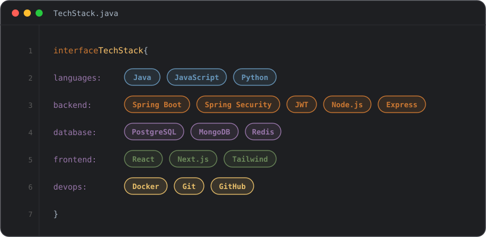

<div align="center">


<pre>
  .   ____          _            __ _ _
 /\\ / ___'_ __ _ _(_)_ __  __ _ \ \ \ \
( ( )\___ | '_ | '_| | '_ \/ _` | \ \ \ \
 \\/  ___)| |_)| | | | | || (_| |  ) ) ) )
  '  |____| .__|_| |_|_| |_\__, | / / / /
 =========|_|==============|___/=/_/_/_/
 <b>:: Aavishkar Chaudhari ::</b>          <i>(Backend Engineer)</i>
</pre>


<br/>


</div>

<br/>

<table align="center" border="0">
<tr><td>

```java
public record Developer(
        String name,
        String role,
        String base,
        String[] focusAreas,
        boolean openToWork
) {
    public static final Developer AAVISHKAR = new Developer(
        "Aavishkar Chaudhari",
        "Backend Engineer · Java / Spring Boot",
        "PCCOE, Pune  ·  B.Tech CE '28",
        new String[] {
            "REST APIs", "Auth & Security", "System Design", "DSA"
        },
        true
    );
}
```

</td></tr>
</table>

---

### `TechStack.java` · my stack
 
<div align="center">

</div>

<div align="center">

</div>

---

### `GET /api/v1/projects` &rarr; 200 OK

<table align="center">
<tr>
<td width="50%" valign="top">

**[Quillora](https://github.com/aavishkarchaudhari/Quillora-Spring-Boot)** · AI-Powered Blogging Platform
<br/>[**`Live Demo ↗`**](https://quillora-blog.vercel.app/)
<br/><sub><code>Spring Boot</code> <code>React</code> <code>PostgreSQL</code> <code>OpenRouter AI</code></sub>

- JWT auth with refresh rotation, RBAC, email verification
- N+1 query elimination via `@EntityGraph` + JPQL
- Bucket4j rate limiting, centralized exception handling
- MapStruct DTOs, Swagger/OpenAPI docs, Dockerized

</td>
<td width="50%" valign="top">

**[ByteURL](https://github.com/aavishkarchaudhari/ByteURL-MERN)** · URL Shortener Platform
<br/>[**`Live Demo ↗`**](https://byteurl.vercel.app/)
<br/><sub><code>MongoDB</code> <code>Express</code> <code>React</code> <code>Node.js</code></sub>

- JWT auth via HTTP-only access & refresh cookies
- Real-time click analytics: device, browser, OS, geo
- MongoDB indexing for concurrent-safe lookups
- Deployed on Vercel + Render

</td>
</tr>
</table>

<p align="center">
<a href="https://aavishkar.me"></a>
</p>

---

### `console.log` · activity

<div align="center">

<p align="center">
  
</p>

<br/>


<br/>


</div>

---

<div align="center">

<a href="https://www.linkedin.com/in/aavishkar-chaudhari/"></a>
<a href="https://mail.google.com/mail/?view=cm&fs=1&to=chaudhariaavishkar77@gmail.com"></a>
<a href="https://aavishkar.me"></a>

<br/>


<br/>


<br/>

<blockquote>
  <i>❝ First, solve the problem. Then, write the code. ❞</i>
</blockquote>

<br/>


</div>
